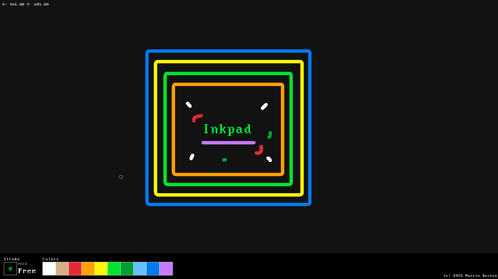

# Inkpad
A whiteboard tool for programmers.



## Getting started
### Dependencies
Inkpad depends on [Raylib](https://www.raylib.com/).

### Building
Build Inkpad for Linux using the script `build.sh` 
```console
$ chmod +x ./build.sh
$ ./build.sh
```

### Usage
After build, run the executable at `bin/` folder.
```console
$ ./bin/inkpad
```

### Installation (optional)
If you are on Linux, you can move the compiled executable to `/usr/local/bin`
to be able to run it from the terminal, you can even create a `*.desktop` file
to make your system threat it as a proper application.

If you are on Windows, you can put it anywhere you want and then create a
shortcut to desktop, start menu and/or taskbar.

## Tutorial

Read the full tutorial [here](./TUTORIAL.md).

---

> By Marcio Dantas
