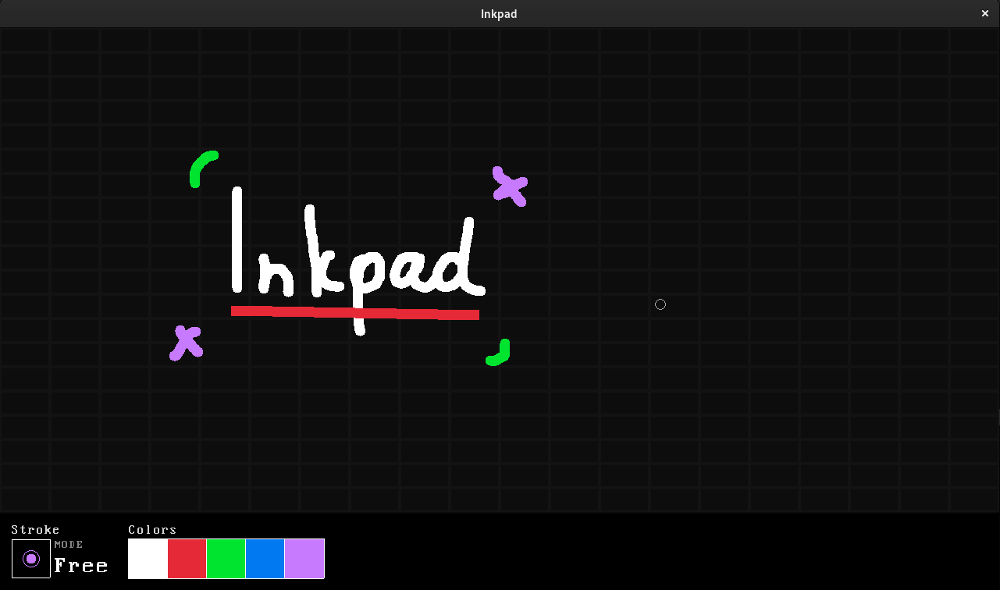

# Inkpad
A concise whiteboard software made to be simple.



## Getting started
### Dependencies
Inkpad depends on [Raylib](https://www.raylib.com/).

### Building
Build Inkpad for Linux using the script `build.sh` 
```console
$ chmod +x ./build.sh
$ ./build.sh
```

### Usage
After build, run the executable at `bin/` folder.
```console
$ ./bin/inkpad
```

---

> By Marcio Dantas
