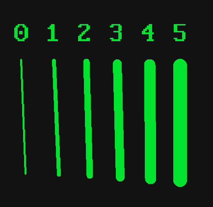
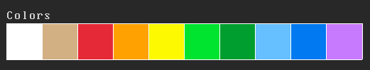

# Inkpad Tutorial
Learn how to use Inkpad.

You may find this document useful.

## Useful topics
- [Keybindings](#keybindings)
- [Utility](#utility)

## Stroke modes
Inkpad works by changing **stroke modes**.
The modes that can be selected are the following:
- Free: Freehand draw
- Line: Draw a straight line
- Rect: Draw a rectangle
- Circle: Draw a circle
- Text: Draw arbitrary text on the canvas
- Erase: Erase drawings on the canvas

To enable the modes, use the following keys:
- Free: `A`
- Line: `L`
- Rect: `R`
- Circle: `C`
- Text: `SPACE`
- Erase: `X`

> _In the Stroke information section, you'll find the mode you are currently in_

### Usage of modes

> `LMB`: Left mouse button

**Free mode**
Free mode works like a normal pen.
Press `LMB` and drag the mouse with `LMB` down
and you will be able to draw freely. 

**Line mode**
Press and hold `LMB` to define the start of a
straight line. Release `LMB` to draw the desired line. 

**Rect mode**
Press and hold `LMB` to define the position of the
rectangle. Release `LMB` to draw the rectangle at that position. 

**Text mode**
Press `LMB` at the position you want to draw the text
and start typing the desired text, to erase the last character typed, press backspace.
When done, press enter to confirm and draw the text.

**Circle mode**
Press and hold `LMB` and drag it to define the radius of the circle.
Release the `LMB` to draw it. 

**Erase mode**
Press `LMB` and drag the mouse with `LMB` down
and you will be able to erase the drawing on the canvas. 

## Other stroke properties

### Overview
Stroke has 2 more properties:
- Thickness: Stroke thickness
- Color: Stroke color

### Thickness

> _Different stroke thickness that Inkpad supports_

To set the thickness of the stroke, press the number keys from `0` to `5` to set the thickness.

### Color

> _Color options_

To select a color for the stroke, click the desired color option in the status panel.

## Pages

> _Select different pages in the page selector_

Inkpad uses a system of **pages**. Basically, you can switch between pages and draw
different things on them. They can be selected using the **page selector** in the
status panel.

### Page selection
To change to a specific page, click on the selector containing the number of the page.
Inkpad has 5 pages for you to use freely. 

To quickly change between pages, use the `.` and `,` keys to go forward and backward, respectively. 

## Status panel
Status panel is the area below the drawing canvas, it contains all information
about the current stroke, the color options and the page selector.

### Status messages
Status messages are shown inside a rectangular white outline after the save button in the Status panel.
Its purpose it to log the main actions you take using Inkpad.

## Utility

### Save button

Use the save button to export your current page as a  `png` image. You just need to click the button in the status panel.
After saving successfully, it is possible to notice a log in the **Status message** section.

> NOTE: It saves the image in the user home directory.

### _Quick erase_

> `RMB`: Right mouse button.

To quickly change to erase mode press and hold `RMB` and use `LMB` to erase.
To go back to the previous mode, release the `RMB`.

### _Quick line_
To quickly draw a line, press and hold `LSHIFT` to quickly change to **line mode** and use `LMB` to start
drawing lines in your canvas.

### Thickness by mouse wheel
You can change the thickness of your stroke by holding left `ALT` and spinning the mouse wheel to make it smaller or bigger.

### Clear screen
To clear the entire canvas, press `CTRL` + `X`.

## Keybindings
Simple table containing all keybindings for the software

| Keybinding    | Description                          |
|:-------------:|:-------------------------------------|
| `Ctrl`+`ESC`  | Exit Inkpad                          |
| `ESC`         | Cancel action                        |
| `.`           | Move to page right                   |
| `0`-`5`       | Set stroke thickness                 |
| `A`           | Set stroke mode to Free              |
| `L`           | Set stroke mode to Line              |
| `R`           | Set stroke mode to Rect              |
| `C`           | Set stroke mode to Circle            |
| `SPACE`       | Set stroke mode to Text              |
| `X`           | Set stroke mode to Erase             |
| `Ctrl`+`X`    | Clear entire canvas of current page  |

---

> Copyright (c) 2025 Marcio Dantas 
