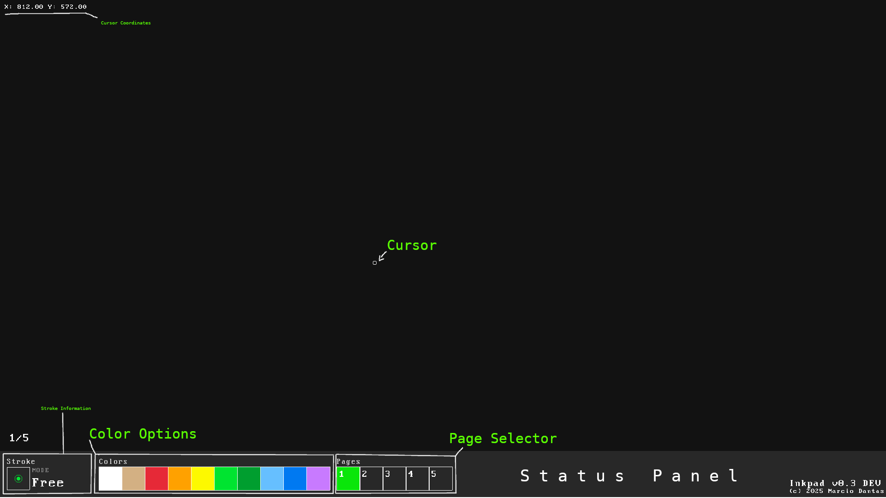

# Inkpad Tutorial

## UI

> _Inkpad UI Reference_

## Stroke modes

Inkpad works by changing **stroke modes**.
The modes that can be selected are the following:
- Free: Freehand draw
- Line: Draw a straight line
- Rect: Draw a rectangle
- Circle: Draw a circle
- Text: Draw arbitrary text on the canvas
- Erase: Erase drawings on the canvas

To enable the modes, use the following keys:
- Free: `A`
- Line: `L`
- Rect: `R`
- Circle: `C`
- Text: `T`
- Erase: `X`

> _In the Stroke information section, you'll find the mode you are currently in_

### Usage of modes

> `LMB`: Left mouse button

**Free mode**
Free mode works like a normal pen.
Press `LMB` and drag the mouse with `LMB` down
and you will be able to draw freely. 

**Line mode**
Press and hold `LMB` to define the start of a
straight line. Release `LMB` to draw the desired line. 

**Rect mode**
Press and hold `LMB` to define the position of the
rectangle. Release `LMB` to draw the rectangle at that position. 

**Text mode**
Press `LMB` at the position you want to draw the text
and start typing the desired text, to erase the last character typed, press backspace.
When done, press enter to confirm and draw the text.

**Circle mode**
Press and hold `LMB` and drag it to define the radius of the circle.
Release the `LMB` to draw it. 

**Erase mode**
Press `LMB` and drag the mouse with `LMB` down
and you will be able to erase the drawing on the canvas. 

## Other stroke properties

### Overview
Stroke has 2 more properties:
- Thickness: Stroke thickness
- Color: Stroke color

### Thickness

> _Different stroke thickness that Inkpad supports_

To set the thickness of the stroke, press the number keys from `0` to `5` to set the thickness.

### Color

> _Color options_

To select a color for the stroke, click the desired color option in the status panel.

## Pages

> _Select different pages in the page selector_

Inkpad uses a system of **pages**. Basically, you can switch between pages and draw
different things on them. They can be selected using the **page selector** in the
status panel.

### Page selector
To change to a specific page, click on the selector containing the number of the page.
Inkpad has 5 pages for you to use freely. 

## Status panel
Status panel is the area below the drawing canvas, it contains all information
about the current stroke, the color options and the page selector.

## Utility

### _Quick erase_
To quickly change to erase mode press and hold `RMB` and use `LMB` to erase.
To go back to the previous mode, release the `RMB`.

### _Quick line_
To quickly draw a line, press and hold `LSHIFT` to change to **line mode** and use `LMB` to start
drawing lines in your canvas.

### Clear screen
To clear the entire canvas, press `CTRL` + `X`.
